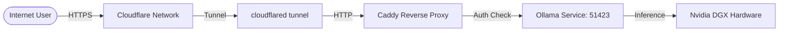

# 🟢 DGX Spark Platform

A private, high-performance, and feature-rich chat interface optimized for **Nvidia DGX Spark** and local LLM execution via Ollama. 

Built with **Next.js 15**, **Tailwind CSS v4**, and **Framer Motion**, this platform provides a premium, Nvidia-themed GPT alternative with absolute privacy and zero data retention.

---

## 🚀 Key Features

- **🧠 Reasoning Mode (Thinking)**: Toggle internal reasoning for supported models to visualize the AI's thought process in a clean, expandable accordion.
- **🎙️ Voice-to-Text**: Built-in, high-fidelity browser voice recognition with real-time interim transcription and visual feedback.
- **🛡️ Absolute Privacy**: **Zero Database used.** All conversations are purely ephemeral and local to your session. No data collection or tracking.
- **🎨 Nvidia-Inspired UI**: Premium dark/light themes with signature neon-green accents, glassmorphism, and smooth Framer Motion transitions.
- **💤 DGX Offline Mode**: Intelligent handling of backend connectivity. If the DGX hardware is resting, the platform gracefully enters a "Resting" state.
- **📊 Real-time Telemetry**: Detailed performance metrics for every response, including tokens generated, total time, and tokens per second.

---

## 🏗️ Backend Architecture

The DGX Spark Platform follows a secure, high-performance network topology to bridge your local DGX hardware with the public web:



1.  **Cloudflare Tunnel**: Securely exposes the local environment.
2.  **Caddy Reverse Proxy**: Handles incoming HTTP requests, performs strict **X_API_KEY** header verification, and routes traffic.
3.  **Local Isolation**: The Ollama instance and DGX hardware remain isolated from direct public access, ensuring maximum security.

---

## 🛠️ Tech Stack

- **Frontend**: [Next.js 15](https://nextjs.org/) (App Router), [React 19](https://react.dev/)
- **Styling**: [Tailwind CSS v4](https://tailwindcss.com/)
- **Animations**: [Framer Motion](https://www.framer.com/motion/)
- **Icons**: [Lucide React](https://lucide.dev/)
- **Markdown**: [React-Markdown](https://github.com/remarkjs/react-markdown) + [Remark-GFM](https://github.com/remarkjs/remark-gfm)
- **Code Highlighting**: [React-Syntax-Highlighter](https://github.com/react-syntax-highlighter/react-syntax-highlighter) (Prism)
- **Backend API**: [Ollama](https://ollama.com/) (Private Instance)
- **Deployment**: [Cloudflare Tunnels](https://www.cloudflare.com/products/tunnel/) for secure remote access to local hardware.

---

## ⚙️ Configuration

Create a `.env` file in the root directory with the following variables:

```env
API_ENDPOINT=https://your-api-endpoint
X_API_KEY=your-secret-api-key
```

- `API_ENDPOINT`: The URL of your Ollama instance (exposed via Cloudflare or local network).
- `X_API_KEY`: Your secret key for authenticated requests to the proxy.

---

## 📦 Installation & Setup

1. **Clone the repository**:
   ```bash
   git clone https://github.com/Haoming9527/DGX-Spark-Platform.git
   cd DGX-Spark-Platform
   ```

2. **Install dependencies**:
   ```bash
   npm install
   ```

3. **Run the development server**:
   ```bash
   npm run dev
   ```

Open [http://localhost:3000](http://localhost:3000) with your browser to experience the platform.

---

## 🌙 Design System

The platform features a **Dynamic Design System** that automatically adapts according to your browser/system preference:

- **Nvidia Dark**: A sleek, high-contrast dark mode using `#0a0a0a` and neon green gradients.
- **Nvidia Light**: A crisp, clean professional light mode using `#f9fafb` with subtle green borders.

---

## 🔐 Security Disclaimer

The **DGX Spark Platform** is designed for private, local-first environments. All LLM processing is handled on your private hardware. By design, No database is connected, and your conversation history is lost upon refreshing the page to ensure total data sovereignty.

---

## ⚖️ Legal Disclaimer

**DGX Spark Platform** is a **personal, non-commercial project** developed for private infrastructure management and local LLM research.

- This project is **not affiliated, associated, authorized, endorsed by, or in any way officially connected** with **NVIDIA Corporation**, or any of its subsidiaries or its affiliates. 
- The name "NVIDIA" as well as related names, marks, emblems, and images are registered trademarks of their respective owners.
- The use of "NVIDIA" or "DGX" in this project is for descriptive purposes only to indicate compatibility with specific hardware environments.

---

## 📄 License

This project is licensed under the **MIT License** - see the [LICENSE](file:///e:/Projects/dgx-spark-platform/LICENSE) file for details.


