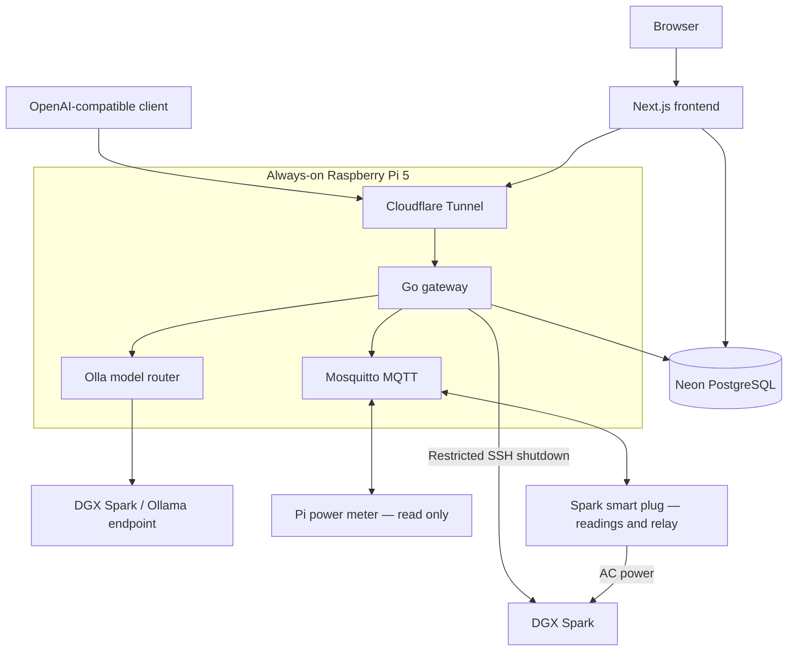

# DGX Spark Platform

**A private AI workspace and homelab dashboard for NVIDIA DGX Spark.**

Chat with your models, connect OpenAI-compatible clients, manage access and usage, and control the hardware that runs it—all from one web interface.

The Raspberry Pi 5 runs the always-on gateway and MQTT broker. The DGX Spark supplies inference when it is powered on. This separation keeps power monitoring and Spark controls available even when the Spark is off, provided the Pi, network, and frontend services are available.

## What you can do

- **Chat with local models** — streamed responses, model selection, reasoning output for supported models, and browser-supported voice input.
- **Use your own clients** — an OpenAI-compatible API with personal `dgx_sk_*` keys, key management, and usage reporting.
- **Manage access** — invite-gated signup, session authentication, user administration, and model restrictions.
- **Monitor infrastructure** — live power, voltage, current, and energy readings from Athom/Tasmota plugs.
- **Control the Spark** — power on remotely or request a graceful SSH shutdown followed by guarded plug cutoff.
- **Separate responsibilities** — users get AI features, operators also get Spark controls, and admins manage the platform.

The interface uses a sticker-poster visual style, with paper/asphalt surfaces, selective color accents, an EXIT navigation plate, and light/dark themes.

## How it fits together


```mermaid
flowchart TD
    Browser[Browser] --> Web[Next.js frontend]
    Client[OpenAI-compatible client] --> Tunnel[Cloudflare Tunnel]
    Web --> Tunnel
    Web --> DB[(Neon PostgreSQL)]

    subgraph Pi[Always-on Raspberry Pi 5]
        Tunnel --> Gateway[Go gateway]
        Gateway --> Olla[Olla model router]
        Gateway --> MQTT[Mosquitto MQTT]
    end

    Gateway --> DB
    Olla --> Inference[DGX Spark / Ollama endpoint]
    Gateway -->|Restricted SSH shutdown| Spark[DGX Spark]
    MQTT <--> PiMeter[Pi power meter — read only]
    MQTT <--> SparkPlug[Spark smart plug — readings and relay]
    SparkPlug -->|AC power| Spark
```

| Component | Responsibility |
| --- | --- |
| **Next.js** | Chat, accounts, API keys, usage views, and authenticated infrastructure UI |
| **Go gateway** | Inference authentication and streaming, usage recording, MQTT readings, and Spark power operations |
| **Olla** | Model discovery, health checks, and routing to configured inference servers |
| **Ollama on Spark** | Model execution and inference |
| **Mosquitto on Pi** | Communication with the Tasmota plugs |
| **Neon PostgreSQL** | Accounts, roles, API keys, model restrictions, and inference usage |
| **Cloudflare Tunnel** | Public HTTPS access to the Pi gateway |

Ollama already exposes OpenAI-compatible endpoints. This project's gateway adds shared authentication, personal API keys, access policies, usage tracking, routing through Olla, and infrastructure controls around those endpoints.

The Go code separates inference in `gateway/api/internal/ai/` from infrastructure in `gateway/api/internal/infra/`.

## Roles and permissions

| Capability | User | Operator | Admin |
| --- | :---: | :---: | :---: |
| Chat, personal API keys, and usage | ✓ | ✓ | ✓ |
| Spark readings and power controls | — | ✓ | ✓ |
| Pi infrastructure readings | — | — | ✓ |
| User and model administration | — | — | ✓ |

Operators use **Spark Power** (`/spark-power`). Admins can also control the Spark under **Admin → Infrastructure** (`/admin/infra`). Server-side checks reload the account's role and disabled status for each infrastructure request.

New accounts receive the `user` role. For a new installation, create your account through signup, then promote that specific account to `admin` in the database. Subsequent role assignments are available in **Admin → Users**.

## Technology

| Layer | Stack |
| --- | --- |
| Web application | Next.js 16, React 19, TypeScript |
| Interface | Tailwind CSS v4, Framer Motion, Lucide |
| Gateway | Go, Eclipse Paho MQTT, Go SSH library |
| Inference routing | Olla and Ollama |
| Database access | Prisma on Next.js; pgx in Go |
| Authentication | bcryptjs, signed JWTs, HTTP-only session cookies |
| Deployment | Vercel or a Next.js host; Docker Compose on Pi; Cloudflare Tunnel |

## Getting started

You will need Node.js compatible with the dependencies (for example, Node.js 22.12+ in the 22.x series), npm, a Neon database, Docker with Compose, and an accessible Ollama inference endpoint. Infrastructure features additionally need the Pi's MQTT broker and configured Tasmota plugs.

### 1. Clone and configure

```bash
git clone https://github.com/Haoming9527/dgx-spark-platform.git
cd dgx-spark-platform
```

Create your environment files without replacing existing settings:

```bash
[ -f .env ] || cp .env.example .env
[ -f gateway/.env ] || cp gateway/.env.example gateway/.env
```

These examples use a Linux/macOS shell; on Windows, copy the files using PowerShell or your editor. Fill in both files before starting services. The complete settings and descriptions are in the [frontend template](.env.example) and [gateway template](gateway/.env.example).

The server-side credentials must match across the two services:

| Next.js environment | Gateway environment | Purpose |
| --- | --- | --- |
| `INFERENCE_GATEWAY_API_KEY` | `CHAT_SERVICE_KEY` | Platform chat requests |
| `INFERENCE_GATEWAY_ADMIN_KEY` | `ADMIN_SERVICE_KEY` | Admin inference requests |
| `INFRA_GATEWAY_READ_KEY` | `INFRA_READ_KEY` | Pi and Spark readings |
| `INFRA_GATEWAY_CONTROL_KEY` | `INFRA_CONTROL_KEY` | Spark power actions |

Use distinct secrets for these purposes. Personal SDK keys are created through the UI; they are separate from these service credentials. Keep `.env` files and SSH private keys out of Git.

Configure the inference endpoints in [Olla's configuration](gateway/config/olla.yaml), including the upstream authentication key. The checked-in hostname is this deployment's example; replace it for your own hardware.

### 2. Prepare the database

For a **new, empty database**, run [schema.sql](schema.sql) in Neon's SQL editor.

For an **existing installation adding operators**, apply [the operator-role migration](sql/migrations/20260928_operator_role.sql) before assigning the new role. Updating application code alone does not change PostgreSQL's existing role constraint.

An error containing `23514` and `users_role_check` while assigning `operator` means that constraint still needs updating. Do not reset an existing database to resolve it.

### 3. Start the gateway on the Pi

```bash
cd gateway
docker compose up -d --build
docker compose ps
curl --fail http://127.0.0.1:50080/healthz
```

The health endpoint should return `ok`. It confirms the gateway process is running; it does not confirm MQTT, SSH, or inference readiness.

| Service | Default address |
| --- | --- |
| Go API | `http://127.0.0.1:50080` on the Pi |
| Olla | `http://olla:40114` within Compose; host port `40114` |

The API host port comes from `API_PORT`; the API container listens on `8080`. Configure `INFRA_READ_KEY` and the MQTT settings even when setting up the AI side first. Spark-specific configuration can be completed later without blocking Pi readings.

Full instructions: [Pi gateway guide](gateway/README.md).

### 4. Start the frontend

From the repository root:

```bash
npm install
npm run dev
```

Open **http://localhost:3000**. For a production build:

```bash
npm run build
npm start
```

Set both `INFERENCE_GATEWAY_URL` and `INFRA_GATEWAY_URL` to a gateway address reachable by the **Next.js server**. Use `http://127.0.0.1:50080` only when Next.js can reach the gateway there, such as on the same machine or through an SSH port forward. A frontend hosted on Vercel needs the public HTTPS gateway URL.

## Public deployment

This deployment uses:

- `www.dgxspark.dev` for the Next.js frontend.
- `api.dgxspark.dev` for the Go gateway on the Pi.
- `sg.dgxspark.dev` for the configured inference endpoint.

Run `cloudflared` on the **Pi** and point its published application route directly to `http://127.0.0.1:50080`. Caddy on the Pi is optional; the existing gateway authenticates requests itself. Caddy on the Spark can continue serving the inference endpoint independently.

For a dashboard-managed tunnel, install the Pi's tunnel connector using Cloudflare's supplied service command, then configure:

| Route field | Value |
| --- | --- |
| Hostname | `api.dgxspark.dev` |
| Service | `http://127.0.0.1:50080` |
| Path | Empty, to forward all gateway paths |

If that hostname already has a DNS record, check its target and move it to the Pi tunnel when ready. Keep the API route on the always-on Pi so Spark shutdown does not remove access to power controls.

Alternatively, use the repository's [locally managed tunnel configuration](gateway/cloudflared.example.yml). Choose either dashboard-managed or locally managed configuration for your tunnel. See [Cloudflare's setup guide](https://developers.cloudflare.com/tunnel/get-started/) for installation.

Then configure the deployed frontend:

```dotenv
INFERENCE_GATEWAY_URL=https://api.dgxspark.dev
INFRA_GATEWAY_URL=https://api.dgxspark.dev
```

Keep the matching service credentials configured and redeploy the frontend. Verify routing with:

```bash
curl --fail https://api.dgxspark.dev/healthz
```

## Spark power control

The Spark controller uses a dedicated MQTT topic and a restricted SSH key. Power-on restores the plug's AC supply; Spark's UEFI **Auto Boot** setting must allow it to start when power returns.

**Shut down & power off** requests normal OS shutdown, requires a successful acknowledgement, then waits for SSH unavailability and 60 continuous seconds of fresh, advancing sensor readings at or below a calibrated off-state wattage. Failed checks cancel cutoff. An uncertain relay-command result is reported as unknown rather than blindly retried.

The threshold is measured on your hardware while the Spark is fully shut down and the plug remains on. It is not a universal value. This is a practical safeguard, not absolute proof of completed shutdown; perform the first complete operation with someone present.

Follow the [Spark power setup guide](gateway/docs/spark-power.md) for the restricted SSH helper, host-key verification, Compose secrets, calibration, and commissioning. The feature provides live readings and operation progress; it does not store 30-day telemetry history.

The SSH address must include its port, for example `spark-2c12.local:22`. A `.local` hostname must resolve from the gateway's Docker container as well as from the Pi shell. Installing Avahi on the Pi alone does not configure the container's resolver. A reserved LAN IP is an alternative when mDNS is unavailable. “Spark unavailable” means the gateway could not verify SSH access; it does not establish that the machine is asleep.

## OpenAI-compatible clients

Create a personal API key in the dashboard, then configure your client with:

```text
Base URL: https://api.dgxspark.dev/v1
API key:  your personal dgx_sk_* key
Model:    an available model ID
```

For example, list accessible models using an environment variable containing your key:

```bash
curl https://api.dgxspark.dev/v1/models \
  -H "Authorization: Bearer $DGX_API_KEY"
```

Endpoint compatibility depends on the gateway and upstream model capabilities. See the application's `/documentation` page for usage examples.

## Repository layout

```text
app/                          Next.js pages, UI components, and API routes
lib/                          Authentication, database access, and shared helpers
prisma/                       Prisma schema and generated-client configuration
schema.sql                    Initial PostgreSQL schema
sql/migrations/               Targeted updates for existing databases
gateway/
  api/main.go                 Go HTTP server entry point
  api/internal/ai/            Inference, authentication, routing, and usage
  api/internal/infra/power/   Read-only Pi meter
  api/internal/infra/spark/   Spark readings and guarded power operations
  config/olla.yaml            Inference routing configuration
  ops/spark/                 Restricted SSH helper and installer
  docs/spark-power.md         Spark setup and calibration guide
  docker-compose.yml         Gateway services
  cloudflared.example.yml    Optional locally managed tunnel configuration
public/                       Static assets
```

## Updates and diagnostics

On the Pi, from `gateway/`:

```bash
git pull
docker compose up -d --build
docker compose logs --tail=50 api
```

Preserve existing `.env` files and add new settings from the examples as needed. After changing gateway environment values, use `docker compose up -d api` to recreate the container; `docker compose restart` does not load those changes. Deploy frontend updates separately and apply any required database migrations.

For development, `npm run lint` checks the frontend. With a compatible local Go toolchain, run `go vet ./...` and `go build .` from `gateway/api/`.

## License and attribution

Released under the [MIT License](LICENSE).

DGX Spark Platform is a personal, non-commercial project and is **not affiliated with NVIDIA**. NVIDIA and DGX are referenced to describe hardware compatibility. Olla, Ollama, and the other dependencies remain the work of their respective maintainers.
