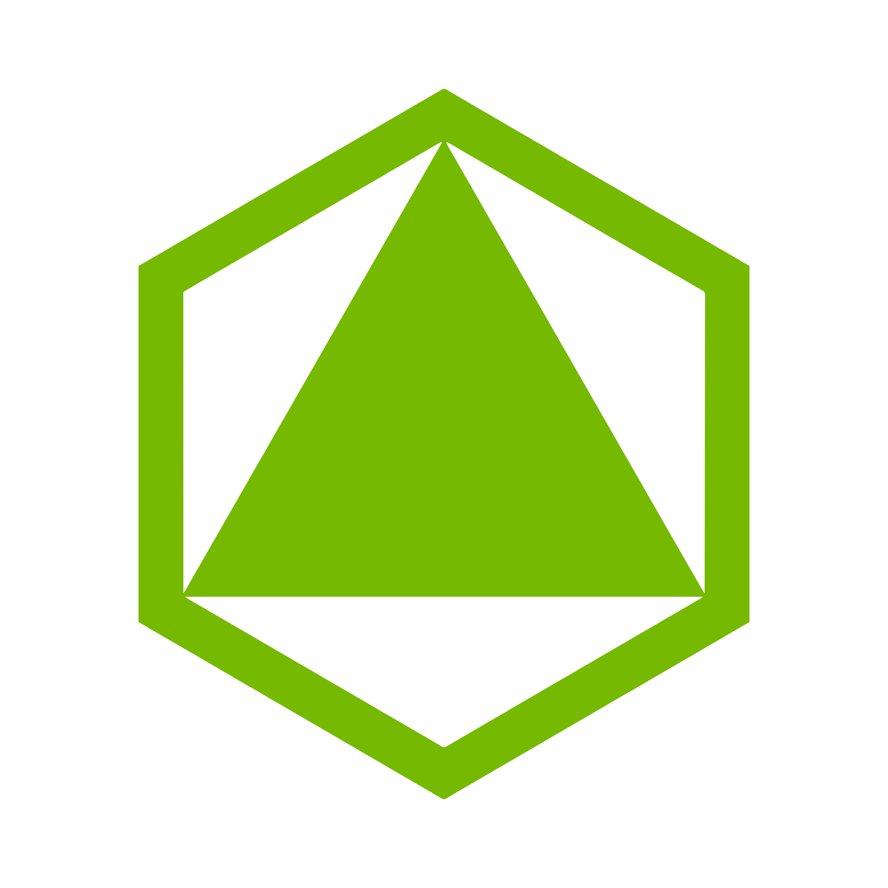
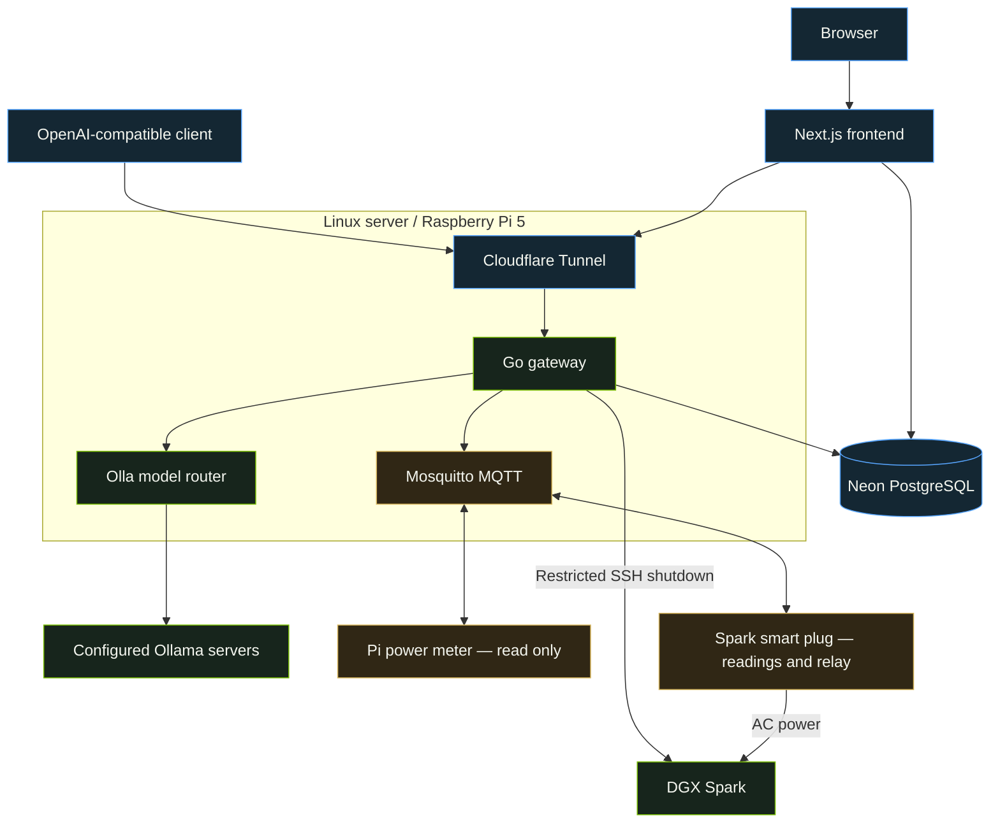

<p align="center">
  
</p>

<h1 align="center">DGX Spark Platform</h1>

<p align="center"><strong>Your AI. Your hardware. Shared with your people.</strong></p>

<p align="center">Local inference, shared access, and physical power control in one platform.</p>

<p align="center">
  <a href="LICENSE"></a>
  
  
  
</p>

<p align="center">
  <a href="#hardware-and-services">Hardware</a> ·
  <a href="#getting-started">Get started</a> ·
  <a href="#roles-and-permissions">Share access</a> ·
  <a href="#spark-power-control">Power controls</a> ·
  <a href="#openai-compatible-clients">API clients</a>
</p>

| Linux server | Inference server | Athom / Tasmota |
| --- | --- | --- |
| Gateway, routing, and optional MQTT | Local models through Ollama | Optional power metering and Spark relay control |
| Raspberry Pi 5 in the reference setup | DGX Spark in the reference setup | Connected to the physical hardware |

Share local AI models through web chat and an OpenAI-compatible API, manage access, and track usage from one interface. Connect your own Ollama server; a DGX Spark is not required for inference.

A separate Linux server hosts the gateway so power controls remain reachable when the inference machine is off. The validated reference setup uses a Raspberry Pi 5, DGX Spark, and Tasmota plugs.

## What you can do

- **Chat with local models** — streamed responses, model selection, reasoning output for supported models, and browser-supported voice input.
- **Choose thinking effort** — light mode answers faster; **Thinking** adds deeper reasoning and more research checks. History, tool evidence, and output are capped; old reasoning is not resent. Ollama retains its configured context size.
- **Search the web** — models search when needed; **+ → Search** requires a search. [LangSearch](https://langsearch.com) returns source text and citations. Set `LANGSEARCH_KEY` on the server, including in Vercel. Source text is capped to keep context bounded.
- **Connect MCP tools** — add your own servers, choose authentication, and approve each tool call in web chat.
- **Use your own clients** — an OpenAI-compatible API with personal `dgx_sk_*` keys, key management, and usage reporting.
- **Manage access** — invite-gated signup, session authentication, user administration, and model restrictions.
- **Monitor infrastructure** — live power, voltage, current, and energy readings from Athom/Tasmota plugs.
- **Control the Spark** — power on remotely or request a graceful SSH shutdown followed by guarded plug cutoff.
- **Separate responsibilities** — users get AI features, operators also get Spark controls, and admins manage the platform.

Bring your own Ollama server, database, and domain. Optional power controls currently support the Spark/Tasmota setup.

## Hardware and services

| Item | Needed for | Reference setup |
| --- | --- | --- |
| AI computer with enough memory and storage for your chosen models | Model inference | NVIDIA DGX Spark running Ollama |
| Linux server with storage, power supply, and network access | Go gateway, Olla, tunnel, and optional MQTT broker | Raspberry Pi 5 with a 64-bit OS; it does not run the models |
| Router and network connection between the gateway and AI computer | Inference, SSH, and MQTT | Reserve LAN addresses for the Pi, Spark, and plugs |
| Tasmota power meter with voltage/current/power/energy readings | Optional Pi monitoring | Athom meter supplying only the Pi; the gateway never switches its relay |
| Separate Tasmota metering plug with a controllable relay | Optional Spark power control | Athom Plug V3 supplying only the Spark |
| Browser or OpenAI-compatible application | User access | Desktop or mobile browser, SDK, or API client |

The smart plugs are optional for AI sharing. Choose plugs rated for your local mains supply and the connected device. Do not power the Linux server through the Spark-controlled outlet. Model memory requirements depend on the model, quantization, context length, and concurrent requests; this project does not define a universal GPU or RAM minimum.

You also need:

- **Neon PostgreSQL** shared by the frontend and Go gateway.
- **A Next.js host**, such as Vercel or your own Node.js server.
- **Docker Engine and Compose** on the gateway host.
- **Your own domain and HTTPS routing** for remote sharing. The guide uses Cloudflare Tunnel on the Pi.
- **Mosquitto** on the Linux server if using the Tasmota features.

The supplied Compose file starts only the Go API and Olla. It does not install Ollama, Mosquitto, Cloudflare Tunnel, the frontend, or the database.

## How it fits together


```mermaid
flowchart TD
    Browser[Browser] --> Web[Next.js frontend]
    Client[OpenAI-compatible client] --> Tunnel[Cloudflare Tunnel]
    Web --> Tunnel
    Web --> DB[(Neon PostgreSQL)]

    subgraph Pi[Linux server / Raspberry Pi 5]
        Tunnel --> Gateway[Go gateway]
        Gateway --> Olla[Olla model router]
        Gateway --> MQTT[Mosquitto MQTT]
    end

    Gateway --> DB
    Olla --> Inference[Configured Ollama servers]
    Gateway -->|Restricted SSH shutdown| Spark[DGX Spark]
    MQTT <--> PiMeter[Pi power meter — read only]
    MQTT <--> SparkPlug[Spark smart plug — readings and relay]
    SparkPlug -->|AC power| Spark

    classDef compute fill:#17251c,stroke:#75B900,color:#f4f6ef
    classDef access fill:#142733,stroke:#58a6ff,color:#f4f6ef
    classDef hardware fill:#302715,stroke:#d7b65d,color:#f4f6ef
    class Gateway,Olla,Inference,Spark compute
    class Browser,Client,Web,Tunnel,DB access
    class MQTT,PiMeter,SparkPlug hardware
```

| Component | Responsibility |
| --- | --- |
| **Next.js** | Chat, accounts, API keys, usage views, and authenticated infrastructure UI |
| **Go gateway** | Inference authentication and streaming, usage recording, MQTT readings, and Spark power operations |
| **Olla** | Model discovery, health checks, and routing to configured inference servers |
| **Ollama** | Model execution on your inference hardware |
| **Mosquitto** | Communication with the optional Tasmota plugs |
| **Neon PostgreSQL** | Accounts, roles, API keys, model restrictions, inference usage, and shared rate limits |
| **Cloudflare Tunnel** | Public HTTPS access to the Linux gateway server |

The gateway adds authentication, access policies, usage tracking, and hardware controls around Ollama's inference API.

## Roles and permissions

| Capability | User | Operator | Admin |
| --- | :---: | :---: | :---: |
| Chat, personal API keys, and usage | ✓ | ✓ | ✓ |
| Spark readings and power controls | — | ✓ | ✓ |
| Pi infrastructure readings | — | — | ✓ |
| User and model administration | — | — | ✓ |

Operators use **Power** (`/power`). Admins can also control the Spark under **Admin → Infrastructure** (`/admin/infra`). Server-side checks reload the account's role and disabled status for each infrastructure request.

New accounts start as `user`. See setup below to create the first admin; manage subsequent roles in **Admin → Users**.

## Technology

| Layer | Stack |
| --- | --- |
| Web application | Next.js 16, React 19, TypeScript |
| Interface | Tailwind CSS v4, Framer Motion, Lucide |
| Gateway | Go, Eclipse Paho MQTT, Go SSH library |
| Inference routing | Olla and Ollama |
| Database access | Prisma on Next.js; pgx in Go |
| Authentication | bcryptjs, signed JWTs, HTTP-only session cookies |
| Deployment | Vercel or a Next.js host; Docker Compose on Pi; Cloudflare Tunnel |

## Getting started

Use Node.js compatible with the dependencies (for example, Node.js 22.12+ in the 22.x series) and npm for the frontend. Install [Docker Engine and the Compose plugin](https://docs.docker.com/engine/install/debian/) on the Pi's 64-bit Debian-based OS. Go is built inside Docker; a host Go installation is only needed for native development.

### Before you start: prepare inference

On the AI computer, install Ollama using its [Linux guide](https://docs.ollama.com/linux), download a model that fits your hardware, and verify it locally:

```bash
ollama pull <model-id>
ollama run <model-id>
curl --fail http://127.0.0.1:11434/api/tags
```

Replace `<model-id>` with an actual Ollama model tag. Make the inference endpoint reachable from the Pi: either through an authenticated HTTPS proxy or through a restricted LAN connection. Ollama's [network configuration guide](https://docs.ollama.com/faq) explains `OLLAMA_HOST`; binding a listener to the network does not add authentication. Keep direct Ollama access limited to trusted hosts.

For the reference HTTPS setup, the upstream proxy must validate `X-API-Key` against your `SG_API_KEY`. This repository does not install that proxy. If you already have an inference endpoint, reuse it.

### 1. Clone and configure

Fork the repository if you want your own deployment to track your changes. Clone it on the Pi for the gateway and on your development machine for frontend work; replace the URL below with your fork when applicable.

```bash
git clone https://github.com/Haoming9527/dgx-spark-platform.git
cd dgx-spark-platform
```

Create your environment files without replacing existing settings:

```bash
[ -f .env ] || cp .env.example .env
[ -f gateway/.env ] || cp gateway/.env.example gateway/.env
```

These examples use a Linux/macOS shell; on Windows, copy the files using PowerShell or your editor. Fill in both files before starting services. The complete settings and descriptions are in the [frontend template](.env.example) and [gateway template](gateway/.env.example).

The server-side credentials must match across the two services:

| Next.js environment | Gateway environment | Purpose |
| --- | --- | --- |
| `INFERENCE_GATEWAY_API_KEY` | `CHAT_SERVICE_KEY` | Platform chat requests |
| `INFERENCE_GATEWAY_ADMIN_KEY` | `ADMIN_SERVICE_KEY` | Admin inference requests |
| `INFRA_GATEWAY_READ_KEY` | `INFRA_READ_KEY` | Pi and Spark readings |
| `INFRA_GATEWAY_CONTROL_KEY` | `INFRA_CONTROL_KEY` | Spark power actions |

Use distinct secrets for these purposes. Personal SDK keys are created through the UI; they are separate from these service credentials. Keep `.env` files and SSH private keys out of Git.

Replace every deployment-specific domain, IP, hostname, and MQTT topic with your own. The `dgxspark.dev` domains in this repository belong to the reference deployment and are not services supplied to people cloning the project.

Set `SG_API_ENDPOINT` in `gateway/.env` to your inference server's base URL. Also edit `discovery.static.endpoints` in [Olla's configuration](gateway/config/olla.yaml): its checked-in `url` is literal, so changing `.env` alone does not update it. Set `url` and `name` for your server and keep `type: ollama`, `model_url: /api/tags`, and the health-check settings. For authenticated HTTPS, keep the existing `auth` block and configure `SG_API_KEY` to match your upstream proxy.

For a private LAN Ollama endpoint, use its LAN address and port, such as `http://192.168.1.50:11434`, in both places. Remove that endpoint's `auth` block if the server has no authentication; the custom header alone does not protect Ollama. Do not publish that unauthenticated endpoint to the Internet.

Generate each service secret separately, for example with `openssl rand -hex 32`. Set the same Neon `DATABASE_URL` in both environments, a separate `JWT_SECRET` for Next.js, and a `REFERRAL_CODE` that you will share with invited users.

**Starting with AI sharing only:** still set a distinct `INFRA_READ_KEY`, which gateway startup requires. In `gateway/.env`, clear `INFRA_CONTROL_KEY`, `DGX_SPARK_HOST`, `DGX_SPARK_IP`, and `DGX_SPARK_SSH_ADDR`. Leave `DGX_SPARK_OFF_MAX_WATTS` empty. This also removes the template's invalid `your-ip` Docker mapping. Keep `MQTT_BROKER_URL` syntactically valid; a missing broker leaves readings unavailable but does not prevent AI startup. Configure power controls later using the linked guide. These steps are for a fresh setup, not a way to bypass an existing controller's recovery state.

### 2. Prepare the database

Run [schema.sql](schema.sql) in Neon's SQL editor **before deploying**, for both new and existing installations. It can be rerun: it preserves data, updates the operator-role constraint, and creates missing rate-limit and MCP tables in one transaction. Building the app does not update the database.

An error containing `23514` and `users_role_check` while assigning `operator` means that constraint still needs updating. Do not reset an existing database to resolve it.

### 3. Start the gateway on the Linux server

```bash
cd gateway
docker compose up -d --build
docker compose ps
curl --fail http://127.0.0.1:50080/healthz
```

The health endpoint should return `ok`. It confirms the gateway process is running; it does not confirm MQTT, SSH, or inference readiness.

| Service | Default address |
| --- | --- |
| Go API | `http://127.0.0.1:50080` on the Pi |
| Olla | `http://olla:40114` within Compose; `http://127.0.0.1:40114` on the Pi |

The API host port comes from `API_PORT`; the API container listens on `8080`. `INFRA_READ_KEY` is required even for an AI-only setup. MQTT connectivity is needed only for readings and power controls; complete Spark-specific configuration when adding those features.

Full instructions: [Pi gateway guide](gateway/README.md).

### 4. Start the frontend

From the repository root:

```bash
npm ci
npm run dev
```

Open **http://localhost:3000**. For a production build:

```bash
npm run build
npm start
```

Set both `INFERENCE_GATEWAY_URL` and `INFRA_GATEWAY_URL` to a gateway address reachable by the **Next.js server**. Use `http://127.0.0.1:50080` only when Next.js can reach the gateway there, such as on the same machine or through an SSH port forward. A frontend hosted on Vercel needs the public HTTPS gateway URL.

For Vercel, first set up the gateway's HTTPS route using [Public deployment](#public-deployment). Import your fork with the repository root as the project directory, copy the root `.env` settings into the project's environment settings, and deploy. Do not use `gateway/` as the frontend project root. Leave `TRUSTED_CLIENT_IP_HEADER` blank on Vercel.

#### Optional: MCP connections

Apply [schema.sql](schema.sql) first if upgrading an existing installation.

Generate a key and save it as `MCP_ENCRYPTION_KEY` in the **frontend** environment:

```bash
node -e "console.log(require('crypto').randomBytes(32).toString('base64'))"
```

Keep that key across deployments; it encrypts saved connection credentials. Deploy the frontend, sign in, then open **+ → MCP**. Add a public HTTPS Streamable HTTP server, choose **OAuth**, **No authentication**, **OAuth or no authentication**, or **Access token**, and select **Use in chat**. Choose a model with tool support. The model chooses relevant tools; each call requires approval.

For OAuth, register `https://YOUR_FRONTEND_DOMAIN/api/mcp/oauth/callback` if the server needs a pre-registered client; enter its issuer and client ID under advanced settings. Otherwise automatic registration is used. Complete sign-in in the new tab, return to chat, and connect again.

Connections are private to each account. OAuth state expires after 10 minutes; duplicate-call receipts expire after 24 hours and are cleaned during MCP use. Tool arguments and results are not stored in the database. Local/private URLs, stdio, legacy SSE, and OpenAI tunnel IDs are not supported. This feature uses the existing local inference flow; it does not migrate the public API to Responses.

### 5. Create the owner account and invite people

Sign up with your configured referral code. In Neon's SQL editor, promote only your account, replacing the example email:

```sql
UPDATE users
SET role = 'admin'
WHERE email = 'your-email@example.com'
RETURNING id, email, role;
```

Confirm exactly one intended account was returned. Refresh your session, open **Admin → Users**, and assign roles there for subsequent users. Keep ordinary collaborators as `user`; grant `operator` only to people who should be able to shut down the shared Spark.

Share the frontend URL and referral code with collaborators. Each person creates their own account and personal API key. Share the gateway's `/v1` base URL with SDK users; never distribute the frontend's service keys, MQTT password, or SSH key. Configure model restrictions in **Admin → Models** and check access with a regular user account before inviting everyone.

**Access scope:** signup is invite-gated, but the current app also allows rate-limited guest chat on unrestricted models. A public frontend is therefore not an invite-only inference service. If your deployment must be private, put the frontend behind an access layer that covers both pages and API routes. Usage reporting is not billing or a per-user spending quota.

### 6. Check the shared setup

- `/healthz` returns `ok` from the gateway URL.
- Models appear in the web UI, a response streams, and stopping generation stops the request.
- A personal API key can list `/v1/models` and make an inference request; an unauthenticated gateway request is rejected.
- A regular user cannot open admin or power-control features.
- If power control is configured, complete the attended checks in the Spark guide before allowing operators to use it.

## Public deployment

Use your own equivalents of these reference hostnames:

- `www.dgxspark.dev` for the Next.js frontend.
- `api.dgxspark.dev` for the Go gateway on the Pi.
- `sg.dgxspark.dev` for the configured inference endpoint.

Run `cloudflared` on the **Pi** and point its published application route directly to `http://127.0.0.1:50080`. Caddy on the Pi is optional; the existing gateway authenticates requests itself. Caddy on the Spark can continue serving the inference endpoint independently.

For a dashboard-managed tunnel, install the Pi's tunnel connector using Cloudflare's supplied service command, then configure:

| Route field | Value |
| --- | --- |
| Hostname | `api.dgxspark.dev` |
| Service | `http://127.0.0.1:50080` |
| Path | Empty, to forward all gateway paths |

If that hostname already has a DNS record, check its target and move it to the Linux server's tunnel when ready. Keep the API route on that server so Spark shutdown does not remove access to power controls.

Alternatively, use the repository's [locally managed tunnel configuration](gateway/cloudflared.example.yml). Choose either dashboard-managed or locally managed configuration for your tunnel. See [Cloudflare's setup guide](https://developers.cloudflare.com/tunnel/get-started/) for installation.

Then configure the deployed frontend:

```dotenv
INFERENCE_GATEWAY_URL=https://api.dgxspark.dev
INFRA_GATEWAY_URL=https://api.dgxspark.dev
```

Keep the matching service credentials configured and redeploy the frontend. Verify routing with:

```bash
curl --fail https://api.dgxspark.dev/healthz
```

Publish only the authenticated Go gateway. Olla's host port is bound to localhost; its upstream API key does not authenticate incoming clients. Do not point a public tunnel or port forward at Olla directly.

Vercel supplies the trusted client IP automatically. When self-hosting Next.js behind a reverse proxy, set `TRUSTED_CLIENT_IP_HEADER` only to a header that the proxy overwrites with the client's IP, and prevent direct access to the origin. Otherwise leave it empty: anonymous requests share one conservative rate-limit bucket. Rate-limit identifiers are hashed and counters expire in Neon.

## Spark power control

Configure an authenticated, LAN-only Mosquitto broker on the gateway server. Set each Tasmota device's broker credentials, distinct topic, and `%prefix%/%topic%/` FullTopic, then copy the settings into `gateway/.env`. See the [meter guide](gateway/README.md) and [power setup guide](gateway/docs/spark-power.md) for installation, SSH keys, and calibration.

Power-on restores AC through the plug; enable **Auto Boot** in the Spark's UEFI. The broker and gateway must remain available while the Spark is off.

**Shut down & power off** blocks new gateway inference and gives active requests up to five minutes to finish. It then requests graceful SSH shutdown and requires acknowledgement, SSH unavailability, and 60 continuous seconds of fresh readings at or below the calibrated off-state wattage before cutting power. Failed checks cancel cutoff; uncertain relay commands are not blindly retried.

Safeguards include a three-minute minimum off interval, five minutes of authenticated readiness before shutdown, persistent operation records, and restart recovery without command replay. Use the maintenance lock or shutdown inhibitors for work outside the gateway.

Calibrate the threshold for each installation; low wattage alone does not prove shutdown. Readings and operation progress are live, with no stored telemetry history.

Use `host:port` for SSH. A `.local` hostname must resolve inside the gateway container; otherwise use a reserved LAN IP. “Spark unavailable” means SSH readiness could not be verified. Monitoring failures and readiness cooldowns do not pause AI requests; requested shutdowns pause new requests while active requests finish. An uncertain shutdown stays paused until recovery is confirmed.

## OpenAI-compatible clients

Create a personal API key in the dashboard, then configure your client with:

```text
Base URL: https://api.dgxspark.dev/v1
API key:  your personal dgx_sk_* key
Model:    an available model ID
```

For example, list accessible models using an environment variable containing your key:

```bash
curl https://api.dgxspark.dev/v1/models \
  -H "Authorization: Bearer $DGX_API_KEY"
```

Endpoint compatibility depends on the gateway and upstream model capabilities. See the application's `/documentation` page for usage examples.

Image inputs accept base64/data URLs and direct public HTTP(S) image URLs on ports 80/443. Private-network destinations and redirects are rejected. PNG, JPEG, WebP, and GIF inputs are limited to 8 MiB and 40 megapixels each, with at most 32 images and 32 MiB of decoded image data per request. JSON requests are limited to 48 MiB. Model permissions apply to the JSON body sent upstream; conflicting query/body model names are rejected. The public gateway forwards supported inference routes only, not upstream administration routes.

## Repository layout

```text
app/                          Next.js pages, UI components, and API routes
lib/                          Authentication, database access, and shared helpers
prisma/                       Prisma schema and generated-client configuration
schema.sql                    PostgreSQL setup and repeatable upgrades
gateway/
  api/main.go                 Go HTTP server entry point
  api/internal/ai/            Inference, authentication, routing, and usage
  api/internal/infra/power/   Read-only Pi meter
  api/internal/infra/spark/   Spark readings and guarded power operations
  config/olla.yaml            Inference routing configuration
  ops/spark/                 Restricted SSH helper and installer
  docs/spark-power.md         Spark setup and calibration guide
  docker-compose.yml         Gateway services
  cloudflared.example.yml    Optional locally managed tunnel configuration
public/                       Static assets
```

## Updates and diagnostics

On the Pi, from `gateway/`:

```bash
git pull
docker compose up -d --build
docker compose logs --tail=50 api
```

Preserve existing `.env` files and add new settings from the examples as needed. After changing gateway environment values, use `docker compose up -d api` to recreate the container; `docker compose restart` does not load those changes. Deploy frontend updates separately and apply any required database migrations.

For a locally hosted frontend, apply [schema.sql](schema.sql), run `npm ci`, `npm run build`, and restart its process.

For development, `npm run lint` checks the frontend. With a compatible local Go toolchain, run `go vet ./...` and `go build .` from `gateway/api/`.

## Contributions welcome

Code, documentation, bug reports, and hardware integrations are welcome. Open an issue for ideas or reproducible bugs, or submit a focused pull request explaining your changes and checks. Preserve authentication and power-control safeguards, and remove secrets from shared logs.

## License and attribution

Released under the [MIT License](LICENSE).

DGX Spark Platform is a personal, non-commercial project and is **not affiliated with NVIDIA**. NVIDIA and DGX are referenced to describe hardware compatibility. Olla, Ollama, and the other dependencies remain the work of their respective maintainers.
